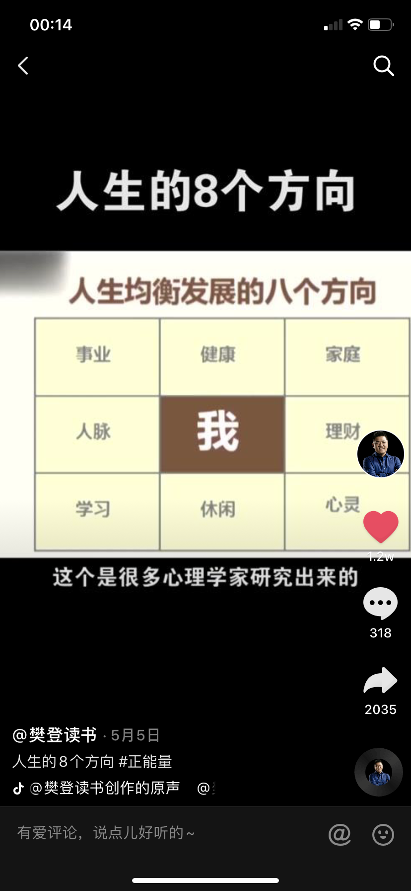

## 时间任务表

### 写在前面

我想说，生活也必定不是一成不变的规律作息。制定这份规则的目的，是为了在自己拥有充足的时间下，不要虚度他们。在无聊的不知道干什么的时候，只是对着手机发呆，那么这份规则便是指引的方向。要把每一天都过得精彩，充分提高我 —— 作为人生这场游戏的玩家 —— 的游戏体验。我要是我人生这场游戏的赢家。:sunglasses:

—— 每一个不曾起舞的日子，都是对生命的辜负 ♪

 

---

### 2020 年 5 月 17 日修改

执行了大约几天的时间表，发现实践起来稍微有些反人类。因为总会有计划赶不上变化的时刻，规定的时间应该做的事情由于别的变化被打乱，可能就会导致之后的计划全部 gg。碰巧在昨天看到了樊登老师的视频，提出了**平衡人生的八个方向**。至此我重新编写任务，按照如图这八个大类，将写下来的事件作为每天的任务，不规定事件，只考虑是否完成，增加了灵活性，从今天开始试行。

---

### 人生的 8 个方向打卡

[Go! =>](./时间任务/2020.06.md)
