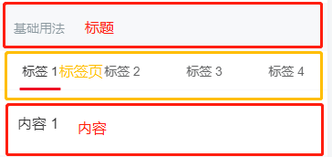

# 移动端项目 Vue+Vant+Better-scroll 制作微信端页面踩坑记录

## 前言

本篇文章为基于`better-scroll`的 vue 移动端项目踩坑记录，**主要围绕**`better-scroll`这个插件在项目中所带来的问题进行记录。

> 当然最后还会有部分章节为其他插件踩坑和一下技巧运用的内容。

详情可以参考下方目录。

### 导航

- <a href='#为什么使用-better-scroll'>为什么使用 better-scroll</a>
  <br>

- <a href='#better-scroll-概要'>better-scroll 概要</a>
  <br>

- <a href='#具体踩坑'>具体踩坑</a>

  - <a href='#初始化完成但是无法滚动'>初始化完成但是无法滚动</a>
  - <a href='#配合-vant-的-tabs-组件时切换后-tab-页面滚动出错'>配合 vant 的 Tabs 组件时，切换后 tab 页面滚动出错</a>
  - <a href='#切换-tab-页滚动至顶部偶现失效'>切换 tab 页滚动至顶部，偶现失效</a>
  - <a href='#在-ios-设备上滚动期间触屏会导致页面高度抖动'>在 ios 设备上，滚动期间触屏会导致页面高度抖动</a>
  - <a href='#实例化时基本的常用配置'>实例化时基本的常用配置</a>

<br>

- <a href='#项目其他踩坑-or-技术'>项目其他踩坑 or 技术</a>
  - <a href='#活用-less-特性重用自定义样式的-vant-组件'>活用 less 特性，重用自定义样式的 vant 组件</a>
  - <a href='#swiperjs-来定制轮播图-loop-属性导致图片加载失败'>SwiperJs 来定制轮播图， loop 属性导致图片加载失败</a>
  - <a href='#微信中使用原生-video-标签的一些问题'>微信中使用原生 Video 标签的一些问题</a>

<br><br><br>

## 为什么使用 better-scroll

其实一开始的核心是为了解决:

> **微信内置浏览器下拉显示网页信息**这个特点，所导致页面动效错乱

的这个问题。

<div align=center>
  
</div>

如图所示，微信浏览器还真的是奇奇怪怪（还有比如说 ios 的底部导航条）。于是我就很好奇为什么会有一个默认的下拉行为，他的意义是什么，我就立刻去网上查了查。<br>
然而根据查询的结果好像并没得到详细合理的解释，大概就是因为微信浏览器是内嵌 webview，而 webview 在小程序应用中需要有这个下拉刷新的默认行为，虽然微信浏览器不需要下拉刷新，但仍然是保留了这个机制。。。<br>
Emm...好吧！ 也许还有更加合理的理由来解释保留这个机制的原因，尽管我还没有找到，但项目要继续完成，于是开始着手解决。<br>
当然要解决这个问题，直接去禁用页面的 `touchmove` 事件显然不是一个稳妥的方案，所以...
<br>

<div align=center>
  
</div>

<br>
搜索了一番，便找到了一款强大的移动端滚动解决方案，better-scroll 这个插件。老实说一开始上手使用还是有点磕磕绊绊的，可能是我没有认真读文档的前导。。anyway，后来随着项目的进行，边用边读文档，越发感到这个插件的功能之强大，实在是非常好用了。

<br><br><br>

## better-scroll 概要

### 介绍

其实早在 bs（简称）之前就了解到 iscroll 滚动库，但其已经停止维护。而 better-scroll 是基于 iscroll 重写的一款解决移动端滚动场景的插件，api 兼容 iscroll，另做了优化。体积小巧功能强大。

<br>

### 滚动原理

先放一张官网上的图，会更加直观清晰。

<div align=center>
  
</div>

滚动原理大致可以理解为`wrapper`是父容器，`content`为子容器。当**子容器的高度超过了父容器**，就可以开启滚动。

这个滚动原理非常重要，我就是事先没有特别注意这里的前导，导致我直接使用的时候发现怎么无论滚动也没有效果，再倒回来看。

> 具体的底层原理是基于`requestAnimationFrame`这个 api 来实现动画，不深入阐述。

<br><br><br>

## 具体踩坑

### 初始化完成但是无法滚动

```html
<div class="wrapper" ref="wrapper">
  <div class="content">
    <router-view />
  </div>
</div>
```

```javascript
import Bscroll from "@better-scroll/core";

export default {
  mounted() {
    let scroll = new BScroll(this.$refs.wrapper, {});
  },
};
```

<br>

> 初始化后无法滚动会有很多原因，首先非常重要的一点是：实例化的时机。

#### 1. `BScroll`的实例化一定要放在`$nextTick`的回调函数中。

```javascript
mounted() {
  this.$nextTick(() => {
    let scroll = new BScroll(this.$refs.wrapper, {})
  })
}
```

这是因为我们要在 DOM 已经渲染完毕后，才能确保获取到需要添加滚动的元素，以及滚动父元素和子元素的高度，来计算是否要添加滚动。

<br>

#### 2. DOM 层级不对

`content`dom 必须是`wrapper`的**第一子元素**。这是官网使用方法给出的规定，遵守即可。

<br>

#### 3. 父元素没有设置固定的高度 or 子元素高度没有超过父元素

这一点很好理解，很简单也很重要。这也就是为什么没有读前导的我发现滚动无效的根本原因。

一定要给父元素固定的高度，因为通常父元素的高度会由子元素撑开，而滚动开启的条件是当子元素的高度超出父元素，所以父元素的固定高度是关键。

```css
.wrapper {
  weight: 100vw;
  height: 100vh;
}
```

此时当子元素`content`的内容高度超出一屏时，自然就能够滚动，而 wrapper 以外的任何元素都不会滚动。

> 那么至此，无论页面是否可以滚动，微信内置浏览器的下拉行为已经阻止，然而踩坑还在继续。

<br><br>

### 配合 vant 的 Tabs 组件时，切换后 tab 页面滚动出错

理解了前导的滚动原理，那么这个问题也基本上不算是问题。

其实一开始看到我的 tab 页的表现是懵的，心想我好好的 tab 页滚动怎么出了问题，烦躁。。

冷静想一想也很简单，无非就是切换 tab 页面的时候动态地改变了子元素的高度，然而插件人家并不知道啊。刚进页面的时候，插件获取了页面的高度，此时一切都正常。tab 页就是对几个 div 进行 display 的切换，**切换 tab 页改变了内容高度，那么让插件重新获取一次即可。** 寻找 api ->

> ps：如果是 layout 级别的应用，记得把实例化的 `scroll` 存储在 store 里面。

```javascript
export default {
  computed: {
    ...mapState({
      scroll: (state) => state.layout.scroll,
    }),
  },
  methods: {
    tabChange() {
      this.$nextTick(() => {
        this.scroll.refresh();
      });
    },
  },
};
```

这里同样需要在`$nextTick`的回调中调用`refresh`，理由如出一辙。

<br><br>

### 切换 tab 页滚动至顶部，偶现失效

整个项目我一共有三个页面使用到了 Tabs 组件，然而在初期制作第一个 Tab 页面的时候，这个问题没有出现过。但是当我所有页面全部制作完成后，第一个制作的 Tab 页面开始作妖了。。。

> 具体表现为切换 tab 页后，无法滚动至顶部，并且预设动效时间变的缓慢，好像被中途停止了一样。

```javascript
export default {
  methods: {
    tabChange() {
      this.scroll.scrollTo(0, 0, 500); // 参数：x坐标 y坐标 动效时间 动画函数

      this.$nextTick(() => {
        this.scroll.refresh();
      });
    },
  },
};
```

我思考滚动至顶部这个动作和计算页面高度并没有任何关联，那么滚动的动作理论上来说可以在`scroll.refresh()`之前执行，没毛病。

尽管如此，我多次尝试改变`scrollTo`和`refresh`的执行顺序依旧没有效果。但有一点很神奇的是，别的 tab 页面没有出现 bug，另外如果我删除动效时间这个参数，那么 bug 会消失。

```javascript
this.scroll.scrollTo(0, 0); // 没有出现bug
```

我思来想去，期间我只做过一件事情，那就是修改了实例化`better-scroll`时的配置选项：

```javascript
{
  useTransition: false, // 我添加了这一条属性
}
```

然而我实际上是必须需要这条配置的，后面的章节会提到。这个选项大致是将页面滚动的效果从 css 的 transition 切换到了 js 来执行，本意是以默认的 css 配置来优化页面滚动的性能。

我猜想，也许是修改配置后执行的`scrollTo`方法和`refresh`方法有冲突，滚动被`refresh`中断等等之类瞎猜的原因，所以我将目标放在了：如何让`scrollTo`方法在`refresh`后执行。

```javascript
tabChange() {
  this.$nextTick(() => {
    this.scorll.refresh();
    this.scorll.scrollTo(0, 0, 500); // 无效
  });
};
```

```javascript
tabChange() {
  this.$nextTick(async () => {
    this.scorll.refresh();
    await this.scorll.scrollTo(0, 0, 500); // 无效
  });
};
```

最后，我想起来曾经看到过

> `$nextTick()`方法不传回调函数返回一个 promise

类似的语句，猜想`$nextTick` 方法挂起的回调函数应该是一个`micro task`，那么我创建一个`macro task`让`scrollTo`方法在`$nextTick`的回调函数结束后在执行，是否会成功呢。

```javascript
tabChange() {
  setTimeout(() => {
    this.scroll.scrollTo(0, 0, 500)
  }, 0)

  this.$nextTick(() => {
    this.scroll.refresh()
  })
}
```

> 结果是成功了

最终虽然解决了问题，但是目前仍然没有探究明白是什么原因导致`scrollTo`方法的失效，以及我的猜想是否正确。

从思考的角度来说，切换 tab 页面，应当先执行`refresh`函数来重新定义`BS`实例所需要的页面信息，然后再执行`scrollTo`函数，让页面滚动到合适的位置。产生该 bug 最大的可能性应该是，由于执行顺序不正确，页面正在处于滚动状态的时候触发`refresh`函数才使得滚动失效。

是否有更加优雅的解决方案，还有对 bug 的探究等日后补充了。

<br><br>

### 在 ios 设备上，滚动期间触屏会导致页面高度抖动

在项目前期我根本没有注意到这个问题，直到我总览整个项目的各个页面的时候，发现这个页面滚动的效果不理想，总是觉得很奇怪，但又说不上来。

于是退出到手机 home 界面打开了设置，开始滑动。那个流畅的感觉...再切回来滑动就很快发现了问题 —— 人们滑动页面的时候并不会等上一次滑动动画结束后才进行下一次的滑动，**通常会进行连续的点击和滑动**，此时页面再安卓端没有任何问题。但是在 ios 上面，则变现为**滑动期间触屏会使页面滚动高度抖动一次**。连续的滑动就会造成连续的抖动，这个问题就很严重了。。。

查询了官网的 issue，给出了如下建议：

```javascript
{
  useTransition: true; // 使用该项配置
}
```

行吧。。。全用 css 毕竟还使有缺陷的，咱们不能要了性能丢了体验，于是滑动流畅多了。

这个问题解决起来还是比较简单，关键是在于如何查找问题。简单的 google 或者 baidu 有时并不会给你满意的答案，这个时候 **官网的 issue 或者一些国外的平台（stack overflow）** 也许会十分有帮助，且高效。

<br><br>

### 实例化时基本的常用配置

```javascript
import BScroll from "@better-scroll/core";

export default {
  mounted() {
    this.$nextTick(() => {
      let scroll = new BScroll(this.$refs.wrapper, {
        // 发现页面触发不了点击事件加上他们
        click: true,
        tap: true,

        // * 触发滚动事件的类型，3为实时触发
        probeType: 3,

        // 允许y方向的滚动
        scrollY: true,

        // 页面滚动到两端时的过量回弹效果，默认是 true
        bounce: false,

        // 使用js实现滚动
        useTransition: false,

        // * 允许触发默认事件的标签名正则
        preventDefaultException: {
          tagName: /^(INPUT|TEXTAREA|BUTTON|SELECT|AUDIO|VIDEO|IMG)$/,
        },
      });
    });
  },
};
```

- 这里重点说两个地方，一是`probeType`

这个属性，简单来说就是触发监听事件的频率。在项目中我有需求去**实时获取滑屏的方向**，来制作顶部导航 slideDown 的效果。那么一开始我发现监听`scroll`事件没有任何反应，我还以为是 api 更新了。看了 issue 才发现当`probeType`值为`1`的时候`scroll`事件是不会触发的。。。

那么具体所对应的值有什么效果，可以去 api 文档去查看，不多赘述。但通常来说，想要完成项目复杂的需求，大多数情况下还是需要`probeType`为`3`。

- 另一个就是`preventDefaultException`

字面意思，这是个正则表达式。在配置中有一个`preventDefault`属性默认值是`true`。该属性禁用了大部分的默认行为，官方也不建议修改此选项。但是我们可以通过`preventDefaultException`属性来恢复部分标签的默认行为。这一点也是比较重要的，官方默认值为

```javascript
{ tagName: /^(INPUT|TEXTAREA|BUTTON|SELECT|AUDIO)$/, }
```

这些。由于项目里面我使用到了 `img` 和 `video` 标签。图片需要长按识别，而视频的默认控件需要默认行为的支持，所以直接将标签名放入这个正则表达式即可。

<br><br><br>

## 项目其他踩坑 or 技术

### 活用 less 特性，重用自定义样式的 vant 组件

通常项目中会有些奇奇怪怪的设计，现有的 ui 库拿来没法直接用。例如我的项目中标签页的设计，他们说叫沉浸式。

正常的标签页是这样子的：

<div align=center>
  
</div>

标题 | 标签页 | 内容

> 三个区域互不干扰，却又有联动。

而我们的设计是这样的：

<div align=center>
  
</div>

没错，在某一个标签的展示中： 内容的一半 | 标签页 | 标题
拥有一个**沉浸式地背景**。

这样一来只能重新设计整个标签页的结构，那么新的结构必须是这样的：

<div align=center>
  
</div>

如此，就可以自定义整块标题+内容区域的样式。

经过一点点的修改和尝试，终于完成了对样式的修改。（同时还要注意标签底部的条动效位置要正确），代码如下：

```less
/deep/ .van-tabs__wrap {
  position: absolute;
  width: 90vw;
  height: 42px;
  top: 100px + 48px;
  transform: translate(5vw);
}
/deep/ .van-hairline--top-bottom::after {
  border: 0;
  border-bottom: 1px solid rgba(51, 51, 51, 0.1);
}
/deep/ .van-tabs__nav {
  justify-content: space-between;
}
/deep/ .van-tab {
  width: 60px;
  flex: 0;
  flex-basis: 70px;
}
```

那么重点来了，依此法修改的组件样式，最好应用于项目中所有的标签页，以防止以后其他页面出现相同需求。那么这一串样式代码在每个组件中去复制显然是比较冗余的。

可以**巧妙的运用 less 封装的能力**将这一串代码放入命名空间。

```less
// global.less

#custom-vant {
  .absolute_tab {
    /deep/ .van-tabs__wrap {
      position: absolute;
      width: 90vw;
      height: 42px;
      top: 100px + 48px;
      transform: translate(5vw);
    }
    /deep/ .van-hairline--top-bottom::after {
      border: 0;
      border-bottom: 1px solid rgba(51, 51, 51, 0.1);
    }
    /deep/ .van-tabs__nav {
      justify-content: space-between;
    }
    /deep/ .van-tab {
      width: 60px;
      flex: 0;
      flex-basis: 70px;
    }
  }
}
```

那么在使用的时候，样式代码会非常地简洁：

```less
@import url("../../assets/css/global.less");

.tabs {
  #custom-vant.absolute_tab();
}
```

记得运用的时候要**引入全局 less 文件**。同样的方法，可以定义全局变量，例如主题颜色等。

```less
// global.less
#theme_color {
  @purple: rgba(73, 56, 141, 1);
  @gray: rgba(153, 153, 153, 1);
  // ...
}
```

```less
@import url("../../assets/css/global.less");
.box {
  background: #theme_color[ @purple ];
}
```

关于 less 的使用，文档上面已经非常的详细了，那么更多的使用技巧欢迎大家一起来讨论学习。

<br><br>

### SwiperJs 来定制轮播图， loop 属性导致图片加载失败

swiper 的轮播图的确非常强大，能够实现的效果真的非常多。但是文档真的不是很好用。。。

最快的方法应该是翻官网上的示例的代码，直接拿过来用。但就这样也不一定就能成功，何况设计可能还有些出入。总之项目有一块轮播的需求是这样的：

<div align=center>
  
</div>

我们的需求和官网的例子还不是完全一样，因为他前后两个 banner 图并不是完全显示的，有一半藏在外面。这倒也好办，直接把 div 拉出屏幕再居中就好了。

问题来了，轮播图需要无限循环。当我加入 loop 这个属性后，第一张图的前 n 张图加载失败了。

<div align=center>
  
</div>

也就是只能看见传入的四张图片。我原本以为是因为引入方式的关系，我将图片地址换为静态路径，线上地址都没有用。

```html
<div class="swiper-container">
  <div class="swiper-wrapper">
    <div class="swiper-slide" v-for="(item, index) in swiperList" :key="index">
      <VanImage class="swiper-img" :src="..." fit="cover" />
    </div>
  </div>
</div>
```

```javascript
export default {
  mounted() {
    this.$nextTick(() => {
      new Swiper(".swiper-container", {
        slidesPerView: 3, // 可以看见3张banner图
        spaceBetween: 8, // 图片之间的间隙
        centeredSlides: true, // 是否居中显示
        loop: true, // 循环显示
      });
    });
  },
};
```

最后我发现了一下奇怪的细节，无法显示的图片，显示的 vant 组件 `Image` 的默认图片，而图片有一丝非常细的边框，就好像底下有图片，被默认 `alt` 属性中的图片遮盖住了。这很神奇。

后来我弃用了 vant 的组件，改成原生的`img`组件，bug 就解决了。也许是因为实现无限循环，重复的图片是拷贝出来的 html 片段，没有 js 代码，而 Vant 组件并没有接受到图片的地址，所以默认贴上了`alt`属性的图片。才导致看起来图片加载失败了。

看来 **不同的组件组合使用的时候，很可能会出现不兼容的情况。** 所以在选择使用的时候还是需要小心一些。

<br>

顺带提一句，轮播图里`item`的样式也是要自己写的。。直接去看官网上面的例子，样式直接拿来用即可。

```less
// 周边的banner图片进行缩放0.8，是在css中写出来的
.swiper-slide {
  // ....

  /* Center slide text vertically */
  display: flex;
  flex-direction: column;
  justify-content: center;
  align-items: center;
  transition: 300ms;
  transform: scale(0.8);
}
.swiper-slide-active,
.swiper-slide-duplicate-active {
  transform: scale(1);
}
```

另外在 vue 项目中使用 swiper 的时候，需要手动引入 swiper 的样式，这也是一个样式无法生效的常见原因。

```less
// less
@import url("../../../node_modules/swiper/css/swiper.min.css");
```

<br><br>

### 微信中使用原生 Video 标签的一些问题

> 最根本的问题其实就是 `andiord` 和 `ios` 端微信浏览器的内核不一样所导致的一系列恶心的问题。

- 安卓端微信浏览器内核为 X5
- ios 端微信浏览器内核是 chrome 内核

ios 端表现其实十分良好，重点就在于安卓端的兼容处理。

**先重中之重！千万不要加这条属性：**

```html
<video x5-video-player-type="h5" />
```

千万不要！这是个大坑，不要尝试在这条属性基础上进行兼容。这条属性意味声明启用同层 h5 播放器。

如果大家有基于同层 h5 播放器好的兼容方案，可以讨论一下。

其余就是一些实现行内播放的兼容属性，常用的属性大致为如下代码

```html
<video
  preload="auto"
  x5-video-orientation="portraint"
  x5-video-player-fullscreen="true"
  x5-playsinline=""
  playsinline=""
  webkit-playsinline=""
  x-webkit-airplay
  controls="controls"
  class="video"
  ref="video"
  src="https://hxy-web1.oss-cn-hangzhou.aliyuncs.com/meiye/wuqihua_vlog_v5.mp4"
  style="object-fit:fill"
/>
```

增加了默认控制组件，竖屏处理，全屏播放，还有行内播放的兼容。

> 还有一点需要注意的是，为了用户体验更加一致，通常不建议使用 `poster`。直接在同位置定位一张图片和按钮，点击后直接进行视频播放。

最后还有一个没有解决的问题：

> 安卓端微信浏览器的视频会出现莫名的黑边，根据宽高比会出现在上下，或者左右，粗细也不同，但始终不会消失。

查询了社区，也没有找到合理的回复解释。不知道大家有没有好的方法能够解决这个问题。

<br><br><br>

## 结语

文章没有太高的技术深度，基本上是以非常普通的话术来描述将一个技术点运用到项目中遇到的坑。会有许多不够严谨和成熟的地方，也欢迎大家一起讨论。此文也贡献给正在使用 `better-scroll` 的同事们，遇到相同的问题可以来借鉴讨论一下。

> 如有转发请告知 (当然肯定是没有的了，我飘了...)

下次见。
